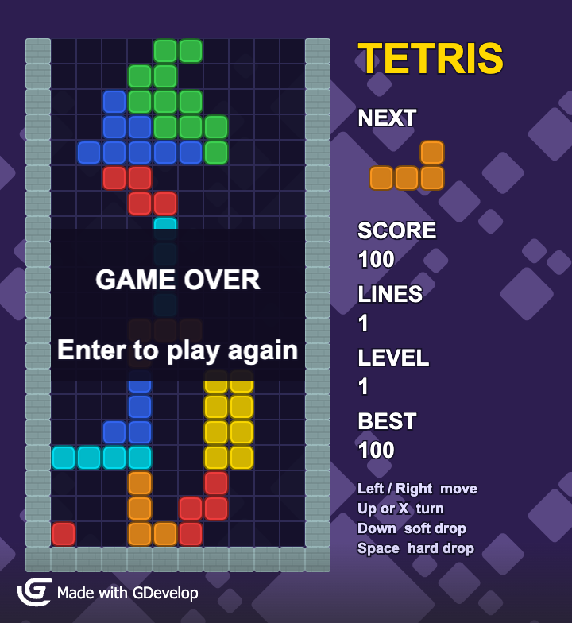

# GDevelop Tetris

A simple Tetris made in [GDevelop](https://gdevelop.io) 5.6. A test of building a GDevelop game with Claude Code.



## Open it

Open `game.json` in the GDevelop desktop app and press **Preview**.

**Controls:** Left / Right move · Up or X turn · Down soft drop · Space hard drop · Enter restart after game over

## How it works

All the logic is in the event sheet of the scene **Game**, split into groups:
Start, Spawn the next piece, Read the keyboard, Move the piece, Land the piece and clear lines, Game over, Score panel.

- Every falling piece is 4 `Active` blocks. When it lands, each becomes a `Settled` block.
- Piece shapes, turning points and colours are in the scene variable **`Shapes`**.
- A move is tried, checked against the walls, floor and settled blocks, and undone if blocked. A blocked turn tries one cell right, then one cell left.
- Rows are checked from the bottom up; a row with 10 blocks is removed and everything above drops a cell.

## Export from the command line

```bash
"/Applications/GDevelop 5.app/Contents/MacOS/GDevelop 5" "$PWD/game.json" \
  --run-command EXPORT_HTML5_EXTERNAL --block-on-diagnostic-errors
```

This writes the HTML5 game to `build/`.

## Assets

From the GDevelop asset store, all by [Kenney](https://kenney.nl), CC0 (public domain):
Small Block (Rolling Ball pack, turned grey so it can be tinted), Wall Grey Flat (Sokoban), Abstract purple background tiles (Abstract Platformer pack).
`cell.png` and `panel.png` are plain squares made for this project.

## Not included (yet)

Sound, hold piece, pause, 7-bag randomiser, lock delay.

`tools/make_game.py` is the script that wrote the first `game.json`. Edit the game in GDevelop now; re-running the script would overwrite those edits.
